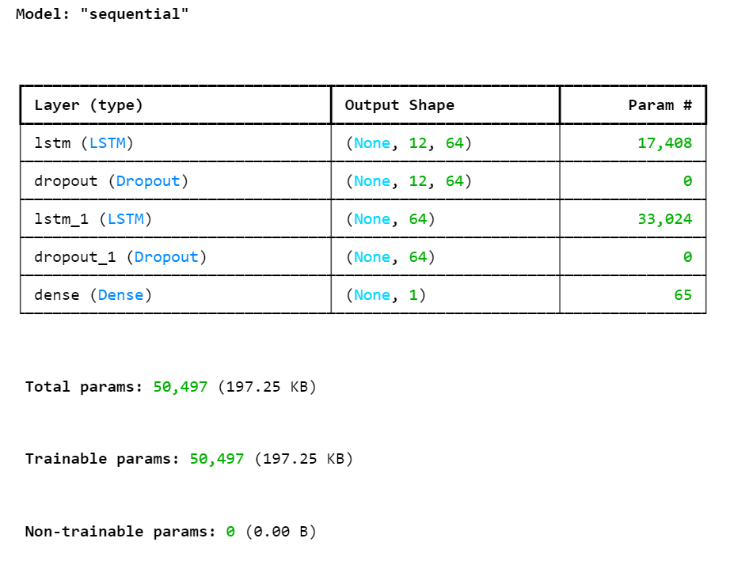
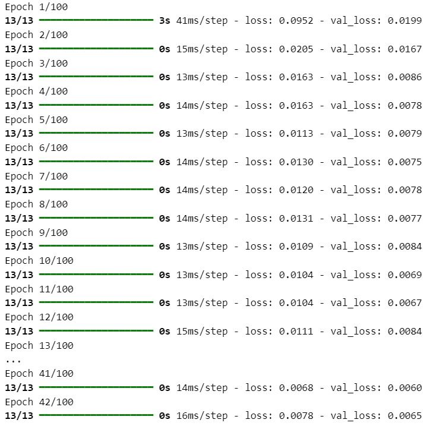
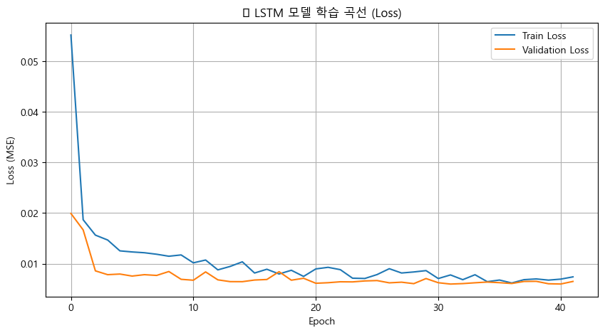
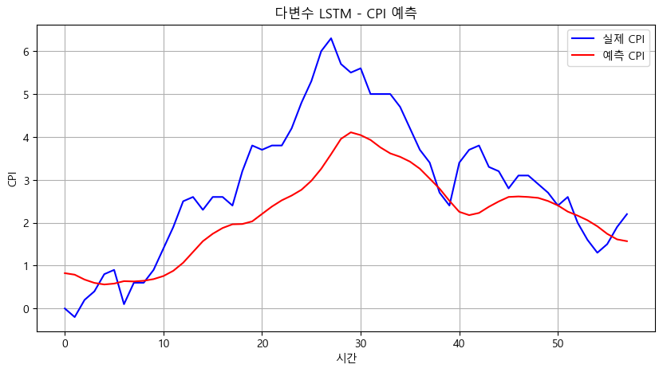
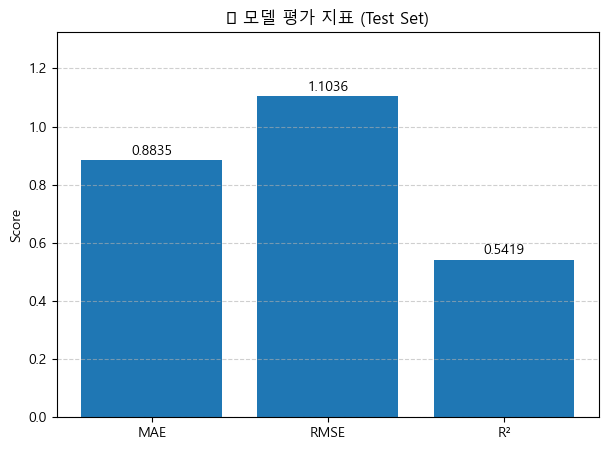
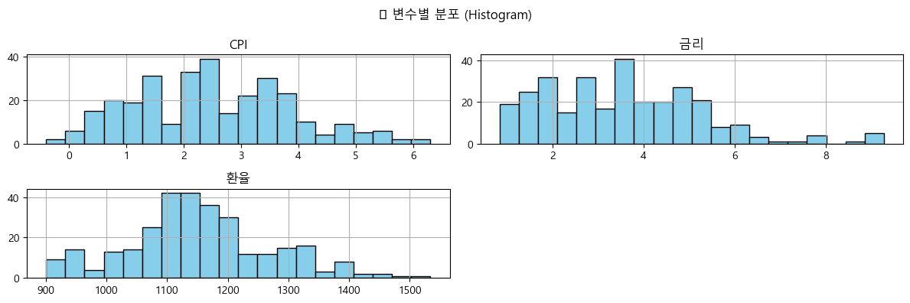
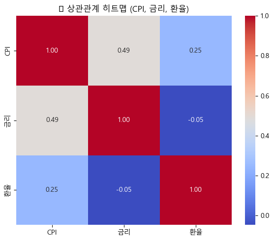
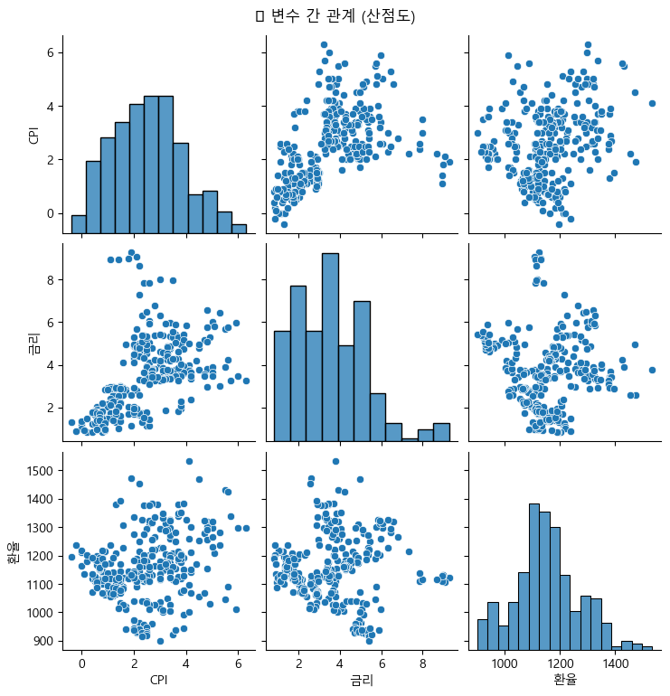
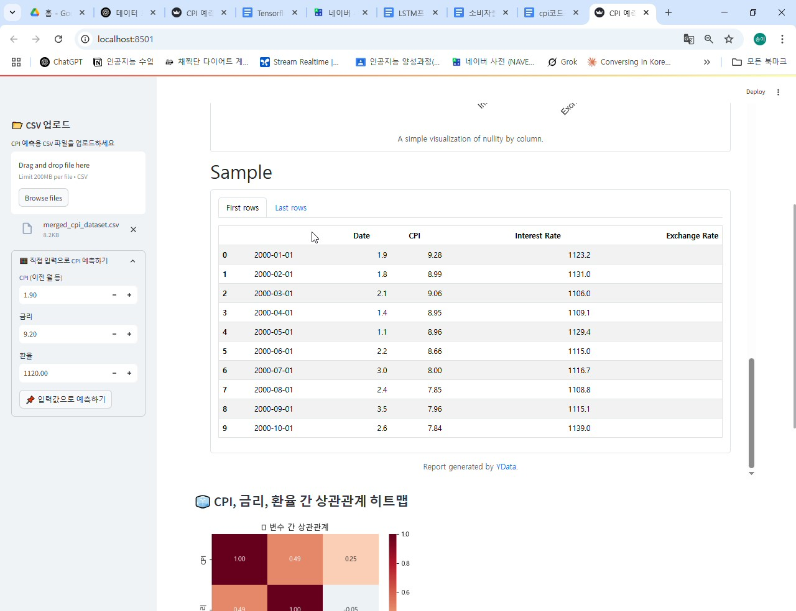

# 📈 CPI 예측 대시보드 (LSTM 기반)

> 소비자물가지수(CPI), 금리, 환율 데이터를 기반으로 한 시계열 예측 시스템  
> Streamlit을 통해 실시간 예측 및 시각화를 지원하는 AI 기반 대시보드

---

## 🎯 프로젝트 개요

- **목표**: 경제 시계열 데이터를 활용하여 CPI(소비자물가상승률)를 예측하고, 대시보드를 통해 직관적으로 시각화
- **모델**: 다변수 LSTM (Multivariate LSTM)
- **UI**: Streamlit 기반 인터페이스
- **핵심 기능**:
  - CSV 파일 업로드 또는 사용자 직접 입력을 통한 예측
  - 데이터 분석 리포트 자동 생성
  - 실제 vs 예측 CPI 시각화
  - 예측 성능 지표(MAE, RMSE, R²) 출력

---

## ⚙️ 기술 스택

| 항목 | 기술 |
|------|------|
| 개발 언어 | Python 3.8+ |
| 딥러닝 | Keras (TensorFlow Backend) |
| 웹 대시보드 | Streamlit |
| 전처리 | pandas, scikit-learn |
| 시각화 | matplotlib, seaborn |
| 자동 리포트 | ydata-profiling |
| 저장 형식 | joblib (모델 저장) |

---

## 📁 프로젝트 구조

DL_PROJECT/
├── dataset/
│ ├── cpi.csv # CPI 원시 데이터
│ ├── exchange_rate.csv # 환율 데이터
│ └── merged_cpi_dataset.csv # 전처리된 통합 데이터
├── cpi_model.pkl # 학습된 LSTM 모델
├── lstm_app.py # Streamlit 대시보드 애플리케이션
├── LSTM_CPI.ipynb # 모델 학습 및 시각화 노트북
└── README.md # 프로젝트 문서

---

## 🧩 주요 기능 요약

- 📂 CSV 업로드 → CPI/금리/환율 기반 LSTM 예측 수행
- 📉 실제 vs 예측 결과 시계열 비교 (Line Chart)
- 📈 모델 평가 지표 표시 (MAE, RMSE, R²)
- 🔍 ydata-profiling을 통한 데이터 분석 리포트 자동 생성
- 🧮 Streamlit 사이드바를 활용한 직접 입력 예측 기능 제공

---

## 🧪 데이터 처리 및 분석

### 🔗 병합 데이터 예시

---

## 🧠 모델 구조 및 학습 과정

### 📌 LSTM 시계열 모델 구조

### 🔄 모델 학습 로그

### 📊 학습 Loss 시각화

---

## 🧾 예측 결과 및 평가

### 🧮 다변수 LSTM 예측 결과 (실제 vs 예측)

### 📈 모델별 성능 비교 지표

---

## 🔍 데이터 탐색 시각화

### 📊 변수 분포 (Histogram)

### 🔥 상관관계 히트맵

### 🧩 산점도 그래프 (변수 간 관계)

---

## 🎥 프로젝트 시연 영상

👉 클릭하여 CPI 예측 대시보드 시연 영상을 확인하세요.

---

## 👩‍💻 개발자

- 이름: 석송이
- 관심분야: 인공지능 기반 웹 서비스, 데이터 시각화, 사용자 중심의 시스템 설계
- 기술목표: AI + 웹 개발 융합 전문가

---

